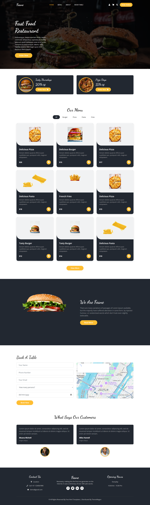

# 🍔 Feane - Fast Food Restaurant Website

A modern and responsive **Fast Food Restaurant Website** built using **HTML, CSS, Bootstrap 4.5, Google Fonts, and Font Awesome**.

The website includes a beautiful restaurant landing page with a hero section, food offers, menu cards, about section, table booking form, testimonials, and footer.

## 🌐 Live Preview

You can add your live website link here:

```text
https://yourusername.github.io/your-repository-name/
```

## 📸 Screenshot




> Place your screenshot image inside the project folder and name it `screenshot.png`.

---

## ✨ Features

* 🍔 Modern restaurant landing page
* 📱 Fully responsive design
* 🧭 Responsive navigation bar
* 🖼️ Hero/banner section
* 🎉 Special food offers section
* 🍕 Food menu section
* 🛒 Shopping cart icons
* 👨‍🍳 About restaurant section
* 📅 Table booking form
* 🗺️ Google Maps integration
* ⭐ Customer testimonials
* 📞 Contact information
* 🕐 Opening hours
* 📱 Mobile-friendly layout
* ✨ Hover animations and effects

---

## 🛠️ Technologies Used

* **HTML5**
* **CSS3**
* **Bootstrap 4.5.3**
* **Font Awesome 5.15.4**
* **Google Fonts**

  * Dancing Script
  * Open Sans
* **JavaScript / jQuery**
* **Google Maps**

---

## 📂 Project Structure

```text
Feane-Restaurant/
│
├── index.html
├── screenshot.png
└── README.md
```

---

## 🎨 Design

The website uses a modern restaurant-style color palette:

* Primary Color: `#ffbe33`
* Dark Background: `#222831`
* White: `#ffffff`
* Card Background: `#f1f2f3`

The main typography uses **Dancing Script** for headings and **Open Sans** for general content.

---

## 📌 Website Sections

### 🏠 Hero Section

The hero section contains:

* Restaurant logo/name
* Navigation menu
* User, cart, and search icons
* Order Online button
* Restaurant heading
* Description
* Order Now button

### 🎉 Offers Section

Displays special restaurant offers such as:

* Tasty Thursdays - 20% Off
* Pizza Days - 15% Off

### 🍕 Menu Section

The menu displays different food categories:

* All
* Burger
* Pizza
* Pasta
* Fries

Food cards contain:

* Food image
* Food name
* Description
* Price
* Shopping cart button

### 👨‍🍳 About Section

Introduces the restaurant with an image, description, and **Read More** button.

### 📅 Book A Table

The booking section includes:

* Name
* Phone Number
* Email
* Number of Persons
* Date
* Book Now button
* Google Maps

### ⭐ Testimonials

Displays customer reviews with customer names and profile images.

### 📞 Footer

The footer contains:

* Contact information
* Restaurant information
* Social media icons
* Opening hours
* Copyright information

---

## 📱 Responsive Design

The website uses Bootstrap's responsive grid system such as:

```html
<div class="col-md-6">
```

and

```html
<div class="col-md-4 col-sm-6">
```

This allows the layout to adapt to different screen sizes including:

* 💻 Desktop
* 💻 Laptop
* 📱 Tablet
* 📱 Mobile

The HTML also includes the responsive viewport meta tag.

---

## 🚀 How to Run

### 1. Clone the repository

```bash
git clone https://github.com/yourusername/your-repository-name.git
```

### 2. Open the project

Go to the project folder:

```bash
cd your-repository-name
```

### 3. Run the website

Open:

```text
index.html
```

in your browser.

You can also use **VS Code Live Server** to run the project.

---

## 🔗 External Resources

### Bootstrap

```text
https://getbootstrap.com/
```

### Font Awesome

```text
https://fontawesome.com/
```

### Google Fonts

```text
https://fonts.google.com/
```

### ThemeWagon

```text
https://themewagon.com/
```

---

## 👨‍💻 Author

**Jaymit Parmar**

GitHub:

```text
https://github.com/yourusername
```

---

## 📄 License

This project is created for **learning and educational purposes**.

---

## ⭐ Support

If you like this project, please consider giving it a ⭐ on GitHub!
